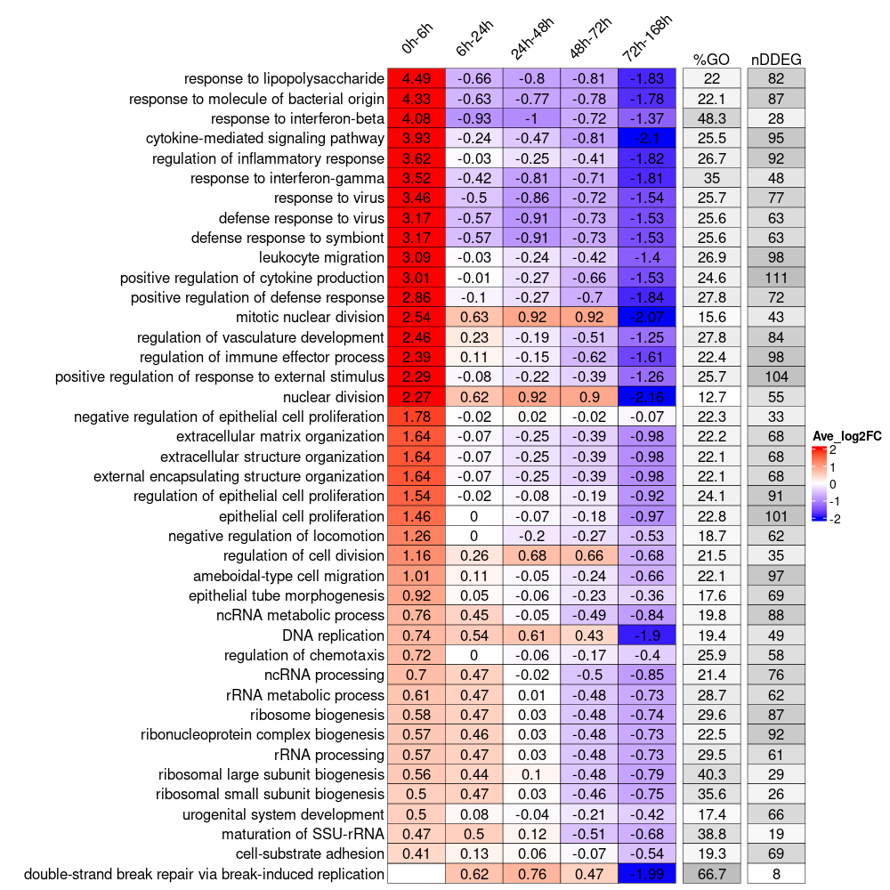

# TrendCatcher Workshop (Bioconductor Conference 2022)

## Instructors

 - Xinge Wang (xwang234@uic.edu)
 - Shang Gao (sgao30@uic.edu)

## To cite TrendCatcher

<a id="1"></a> 
Wang X, Sanborn MA, Dai Y, Rehman J. Temporal transcriptomic analysis using TrendCatcher identifies early and persistent neutrophil activation in severe COVID-19. JCI Insight. 2022 Apr 8;7(7):e157255. doi: 10.1172/jci.insight.157255. PMID: 35175937; PMCID: PMC9057597.

# Workshop Description

## Introduction to TrendCatcher
TrendCatcher is a versatile R package for identifying dynamic differentially expressed genes (DDEGs) in RNA-seq longitudinal studies. A time course experiment is a widely used design in the study of cellular processes such as cell differentiation or response to external stimuli. Temporal changes to the gene expression, such as mRNA, is the key to characterizing such biological processes. Here, we present a versatile R package named TrendCatcher to identify the dynamic differentially expressed genes along the biological process time course. TrendCatcher uses a framework that combines the smoothing spline ANOVA model and break point searching strategy. Not only can it identify the most dynamic genes, but also can assign temporal trajectory patterns to them. A unique feature of TrendCatcher is the ability to show users the biological pathway enrichment changing over time, which can be used to highlight the distinct transcriptional programs that are associated with dynamic biological processes.

## TrendCatcher Framework Overview

The workflow of TrendCatcher is shown in the figure below. TrendCatcher classifies the observation data into baseline observation count and non-baseline observation count. TrendCatcher fits the constant model to the baseline observation count data, and estimates the baseline fluctuation confidence interval. Then TrendCatcher fits the smooth spline ANOVA model to the non-baseline count data, to estimate the mean count (transcriptional dynamic signal) at each time point. Then, for each non-baseline estimated mean count, TrendCatcher performs an hypothesis test against the baseline fluctuation confidence interval. Later, followed by Fisher's combined probability test, a gene-wise dynamic differentially expressed significance is evaluated. By connecting all the significant transcriptional dynamic signals, and following a break point searching strategy, TrendCatcher is able to assign a trajectory pattern to each gene.

For the output of TrendCatcher, there are mainly 2 components: a master table and a set of functions for versatile visualization purposes. The master table contains all the dynamic details of each single gene, including its dynamic P value, its break point location time, and its dynamic trajectory pattern. In addition to the master table, TrendCatcher produces 5 main types of visualizations: (a) a figure showing the observed counts and fitted splines of each gene, (b) genes trajectories from each trajectory pattern group, (c) a hierarchical pie chart that represents trajectory pattern composition, (d) a TimeHeatmap to infer trajectory dynamics of top dynamic biological pathways, and (e) a 2-sided bar plot to show the top most positively and negatively changed (averaged accumulative log2FC) biological pathways.


## Workshop Outline

  
  - 1. Identify dynamic differentially expressed genes (DDEGs) and generate master table.
  - 2. Analysis trajectories of DDEGs.
  - 3. Generate TimeHeatmap.
  - 4. Compare a biological pathway temporal behavior between two groups.
  

# Installation 

## Use docker image

A TrendCatcher docker image that contains the installed TrendCatcher R packages and all its dependencies was generated using [BuildAbiocWorkshop](https://github.com/seandavi/BuildABiocWorkshop). Please install it using the following command, 

```sh
docker run -e PASSWORD=abc -p 8787:8787 http://ghcr.io/wangxinge/trendcatcherworkshopbioc2022
```
## Use install_github()

* Install latest development version from GitHub (requires [devtools](https://github.com/hadley/devtools) package):

```r
if (!require("devtools")) {
  install.packages("devtools")
}
devtools::install_github("jaleesr/TrendCatcher", dependencies = TRUE, build_vignettes = FALSE)
```

# Documentation and Further details

Instructions, documentation, and tutorials can be found at:

+ [https://jaleesr.github.io/TrendCatcher](https://jaleesr.github.io/TrendCatcher/)
+ [https://jaleesr.github.io/TrendCatcherWorkshopBIOC2022](https://jaleesr.github.io/TrendCatcherWorkshopBIOC2022/)


# Some highlights of using **TrendCatcher**.

Some quick examples to show how to use **TrendCatcher**.

### 1. Identify dynamic differentially expressed genes (DDEGs) and generate master.list

```r
library("TrendCatcher")
example.file.path<-system.file("extdata", "Brain_DemoCountTable.csv", package = "TrendCatcher")
master.list<-run_TrendCatcher(count.table.path = example.file.path, 
baseline.t = 0,
time.unit = "h",
min.low.count = 1,
para.core.n = NA,
dyn.p.thres = 0.05)

```

### 2. Draw individual gene trajectory with observed data and fitted data

```r
gene.symbol.arr<-unique(master.list$master.table$Symbol)[1:6]
p<-draw_GeneTraj(master.list = master.list, gene.symbol.arr = gene.symbol.arr, ncol = 3, nrow = 2)
p
```


## 3. Group genes based on their trajectory pattern type

```r
draw_TrajClusterGrid(
  master.list,
  min.traj.n = 10,
  save.as.PDF = NA,
  pdf.width = 10,
  pdf.height = 10
)
```


## 4. Dynamic progamming using TimeHeatmap

Generate a TimeHeatmap to visualize the most dynamic top N biological pathways enrichment change 
over time, we designed a window-sliding strategy to capture all the up-regulated or 
down-regulated genes for each time interval.




